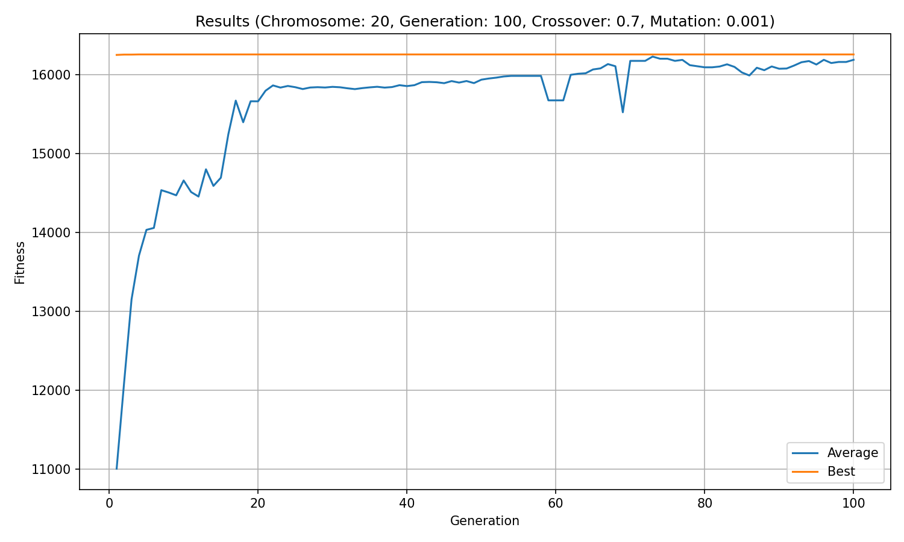

# Soft Computing

<p align="center">
  
</p>

<p align="center">
  <em>Genetic algorithm convergence: average vs. best fitness across 100 generations.</em>
</p>

Implementations of two classic soft computing algorithms in C, written from scratch as a learning exercise.

## What's inside

### Genetic Algorithm
Evolves a population of binary chromosomes over generations to maximize a fitness function (`255x - x²`). Uses roulette wheel selection, one-point crossover, and bit-flip mutation. Outputs per-generation stats to CSV and plots them with Python/matplotlib.

**Parameters:** 20 chromosomes · 8-bit genome · 100 generations · 70% crossover rate · 0.1% mutation rate (adjustable at the top of `main()`)

### Simulated Annealing
Minimizes a 2-variable function by wandering through the solution space and occasionally accepting worse solutions. The temperature controls how reckless it's willing to be. As it cools, it settles into a minimum.

**Parameters:** Metropolis criterion · geometric cooling (c = 0.9) · Boltzmann constant k = 1 (adjustable at the top of `main()`)

## Structure

```
assets/                       # images used by this README (tracked)

genetic-algorithm/
  src/genetic_algorithm.c     # core algorithm
  src/visualise.py            # plots output CSV
  bin/                        # compiled binary (generated, git-ignored)
  output/                     # CSV and plot (generated, git-ignored)

simulated-annealing/
  src/simulated_annealing.c   # core algorithm
  bin/                        # compiled binary (generated, git-ignored)
```

`bin/` and `output/` are created on demand and excluded from version control; only sources and the README image are tracked.

## Building & Running

Both programs resolve their paths relative to their own project directory, so run them from there.

### Genetic Algorithm

The visualiser needs Python dependencies:

```bash
pip install matplotlib pandas
```

```bash
cd genetic-algorithm
mkdir -p bin
gcc src/genetic_algorithm.c -o bin/ga -lm

./bin/ga                    # writes output/output.csv (creates output/ if missing)
python3 src/visualise.py    # reads output/output.csv, writes output/plot.png
```

### Simulated Annealing

Prints to stdout only:

```bash
cd simulated-annealing
mkdir -p bin
gcc src/simulated_annealing.c -o bin/sa -lm

./bin/sa
```

## License

MIT. See [LICENSE](LICENSE).
